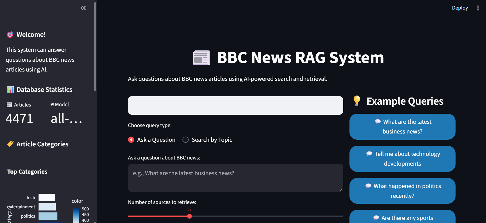

# 📰 BBC News Articles RAG System

A powerful **Retrieval-Augmented Generation (RAG) system** that allows you to ask questions about BBC news articles using AI-powered semantic search and natural language processing.


## 🌟 Features

- 🔍 **Semantic Search**: Find relevant articles using natural language queries
- 🗄️ **Vector Database**: Fast similarity search using ChromaDB
- 📄 **Document Chunking**: Intelligent text splitting for better retrieval
- 🖥️ **Web Interface**: Beautiful Streamlit frontend with interactive charts
- 📊 **Analytics Dashboard**: Database statistics and category distribution
- 🤖 **AI-Powered Answers**: Google Gemini integration for intelligent responses
- 📱 **Responsive Design**: Works on desktop and mobile devices
- 🔒 **Secure**: API keys stored in environment variables

## 📸 Screenshots

### Main Interface

*Clean and modern web interface with query input and results display*

### Database Statistics

*Interactive sidebar showing article counts, categories, and text statistics*

### Query Results

*AI-generated answers with source citations and relevance scores*

### Sources

*Source citations with expandable article previews and metadata*

## 🚀 Quick Start

### Prerequisites
- Python 3.8 or higher
- 4GB+ RAM recommended
- Internet connection (for initial setup)

### Installation

1. **Clone the repository**
   ```bash
   git clone <your-repo-url>
   cd RAG
   ```

2. **Create virtual environment**
   ```bash
   python -m venv venv
   venv\Scripts\activate  # Windows
   # or
   source venv/bin/activate  # Linux/Mac
   ```

3. **Install dependencies**
   ```bash
   pip install -r requirements.txt
   ```

4. **Set up API key (Optional)**
   ```bash
   python setup_gemini_key.py
   ```
   Get your FREE API key from: https://makersuite.google.com/app/apikey

5. **Run the application**
   ```bash
   streamlit run streamlit_app.py
   ```

6. **Open your browser**
   Navigate to `http://localhost:8501`

## 📁 Project Structure

```
RAG/
├── 📊 bbc_news_articles/
│   └── bbc_news_text_complexity_summarization.csv  # 2,127 news articles
├── 🗄️ chroma_db/                                    # Vector database (auto-created)
├── 🐍 Core Python Files
│   ├── data_preprocessor.py                        # Data cleaning and preprocessing
│   ├── vector_database.py                          # Vector DB operations
│   ├── rag_system.py                               # Main RAG functionality
│   └── main.py                                     # CLI application
├── 🌐 Web Interface
│   └── streamlit_app.py                            # Streamlit frontend
├── ⚙️ Setup Scripts
│   ├── setup_gemini_key.py                         # Google Gemini API setup
│   ├── setup_rag_with_gemini.py                    # Complete setup with Gemini
│   └── setup_rag_with_llm.py                       # Setup with OpenAI
├── 🚀 Launchers
│   ├── run_streamlit.bat                           # Windows batch launcher
│   └── run_streamlit.ps1                           # PowerShell launcher
├── 📋 Configuration
│   ├── requirements.txt                             # Python dependencies
│   ├── .env                                        # Environment variables
│   └── .gitignore                                  # Git ignore rules
└── 📖 Documentation
    └── README.md                                   # This file
```

## 🎯 How It Works

### 1. Data Processing
- **Load**: 2,127 BBC news articles from CSV
- **Clean**: Remove special characters, normalize text
- **Chunk**: Split articles into 1,500-character chunks with 300-character overlap
- **Embed**: Generate 384-dimensional vectors using `all-MiniLM-L6-v2`

### 2. Vector Storage
- **Database**: ChromaDB for persistent vector storage
- **Indexing**: Fast similarity search using cosine similarity
- **Metadata**: Store article categories, readability scores, summaries

### 3. Query Processing
- **Input**: Natural language questions or topics
- **Embedding**: Convert query to vector representation
- **Retrieval**: Find most similar document chunks
- **Generation**: Use AI to generate intelligent answers

## 🖥️ Usage

### Web Interface (Recommended)

1. **Start the app**
   ```bash
   streamlit run streamlit_app.py
   ```

2. **Ask questions**
   - Type: "What are the latest business news?"
   - Click example buttons for quick queries
   - Adjust number of results with sliders

3. **Search topics**
   - Type: "technology", "politics", "sports"
   - View relevance scores and article previews
   - Expand sources for detailed information

### Command Line Interface

```bash
python main.py
```

**Available Commands:**
- `ask <question>` - Ask a question about the news
- `search <topic>` - Search for articles by topic
- `stats` - Show database statistics
- `rebuild` - Rebuild the database
- `help` - Show help information
- `quit` - Exit the application

## 📊 Data Information

**Dataset**: 2,127 BBC news articles with rich metadata

**Columns:**
- `text`: Main article content
- `labels`: Article categories (business, technology, politics, etc.)
- `no_sentences`: Number of sentences
- `Flesch Reading Ease Score`: Readability metric (0-100)
- `Dale-Chall Readability Score`: Advanced readability metric
- `text_rank_summary`: TextRank algorithm summary
- `lsa_summary`: Latent Semantic Analysis summary

**Categories:**
- Business & Economy
- Technology & Science
- Politics & Government
- Sports & Entertainment
- Health & Lifestyle
- World News

## 🔧 Technical Details

### Architecture
```
┌─────────────────┐    ┌──────────────────┐    ┌─────────────────┐
│   Data Source   │───▶│  Preprocessing   │───▶│  Vector Store   │
│   (CSV Files)   │    │  (Text Cleaning) │    │   (ChromaDB)    │
└─────────────────┘    └──────────────────┘    └─────────────────┘
                                                         │
┌─────────────────┐    ┌──────────────────┐    ┌─────────────────┐
│   User Query    │───▶│  Query Embedding │───▶│  Similarity     │
│   (Natural Lang)│    │  (SentenceTrans) │    │   Search        │
└─────────────────┘    └──────────────────┘    └─────────────────┘
                                                         │
┌─────────────────┐    ┌──────────────────┐    ┌─────────────────┐
│  AI Response    │◀───│  Answer          │◀───│  Retrieved      │
│  (Generated)    │    │  Generation      │    │  Documents      │
└─────────────────┘    └──────────────────┘    └─────────────────┘
```

### Technology Stack

**Backend:**
- **Python 3.8+**: Core programming language
- **ChromaDB**: Vector database for similarity search
- **SentenceTransformers**: Text embedding generation
- **LangChain**: LLM integration framework
- **Pandas**: Data processing and analysis

**Frontend:**
- **Streamlit**: Web application framework
- **Plotly**: Interactive charts and visualizations
- **Custom CSS**: Modern styling and responsive design

**AI/ML:**
- **all-MiniLM-L6-v2**: Embedding model (384 dimensions)
- **Google Gemini Pro**: LLM for answer generation (FREE)
- **OpenAI GPT**: Alternative LLM option (paid)

### Performance
- **Initialization**: 5-10 minutes (first run)
- **Query Speed**: < 2 seconds per query
- **Memory Usage**: 2-4GB RAM
- **Storage**: ~500MB for vector database
- **Accuracy**: High semantic similarity matching

## 🛠️ Configuration

### Environment Variables
Create a `.env` file in the project root:
```env
GOOGLE_API_KEY=your_gemini_api_key_here
OPENAI_API_KEY=your_openai_api_key_here  # Optional
```

### API Keys Setup

**Google Gemini (FREE):**
1. Go to https://makersuite.google.com/app/apikey
2. Sign in with Google account
3. Click "Create API Key"
4. Copy the key and add to `.env` file

**OpenAI (Paid):**
1. Go to https://platform.openai.com/api-keys
2. Create account and add payment method
3. Generate API key
4. Add to `.env` file

## 🚀 Deployment

### Local Development
```bash
# Development mode with auto-reload
streamlit run streamlit_app.py --server.runOnSave true
```

### Production Deployment

**Streamlit Cloud:**
1. Push code to GitHub
2. Connect to Streamlit Cloud
3. Add environment variables
4. Deploy automatically

**Docker:**
```dockerfile
FROM python:3.9-slim
WORKDIR /app
COPY requirements.txt .
RUN pip install -r requirements.txt
COPY . .
EXPOSE 8501
CMD ["streamlit", "run", "streamlit_app.py"]
```

## 🐛 Troubleshooting

### Common Issues

**1. Import Errors**
```bash
# Solution: Install missing packages
pip install -r requirements.txt
```

**2. API Key Not Found**
```bash
# Solution: Set up API key
python setup_gemini_key.py
```

**3. Database Initialization Failed**
```bash
# Solution: Check CSV file exists
ls bbc_news_articles/bbc_news_text_complexity_summarization.csv
```

**4. Memory Issues**
- Close other applications
- Reduce batch size in `vector_database.py`
- Use smaller embedding model

**5. Slow Performance**
- First run takes longer due to embedding generation
- Subsequent queries are much faster
- Consider using GPU for faster processing

### Debug Mode
```bash
# Enable debug logging
export STREAMLIT_LOGGER_LEVEL=debug
streamlit run streamlit_app.py
```

## 📈 Performance Optimization

### For Large Datasets
1. **Increase batch size** in `vector_database.py`
2. **Use GPU** for embedding generation
3. **Implement caching** for frequent queries
4. **Use smaller chunks** for faster retrieval

### For Production
1. **Add authentication** for user access
2. **Implement rate limiting** for API calls
3. **Add monitoring** and logging
4. **Use CDN** for static assets

## 🤝 Contributing

1. Fork the repository
2. Create a feature branch (`git checkout -b feature/amazing-feature`)
3. Commit your changes (`git commit -m 'Add amazing feature'`)
4. Push to the branch (`git push origin feature/amazing-feature`)
5. Open a Pull Request

## 🙏 Acknowledgments

- **BBC News** for providing the dataset
- **Hugging Face** for the SentenceTransformers library
- **ChromaDB** for vector database capabilities
- **Streamlit** for the web framework
- **Google** for the free Gemini API

## 📞 Support

- **Issues**: [GitHub Issues](https://github.com/yourusername/rag-system/issues)
- **Discussions**: [GitHub Discussions](https://github.com/yourusername/rag-system/discussions)
- **Email**: your.email@example.com

## 🎉 What's Next?

- [ ] Add more data sources (Reuters, CNN, etc.)
- [ ] Implement real-time news updates
- [ ] Add multi-language support
- [ ] Create mobile app version
- [ ] Add advanced analytics dashboard
- [ ] Implement user authentication
- [ ] Add collaborative features

---

**Made with ❤️ using Python, Streamlit, and AI**

*Enjoy exploring your BBC news articles with AI-powered search!* 🚀
